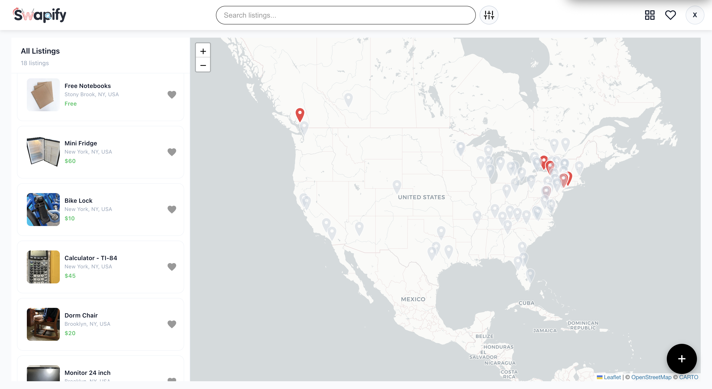
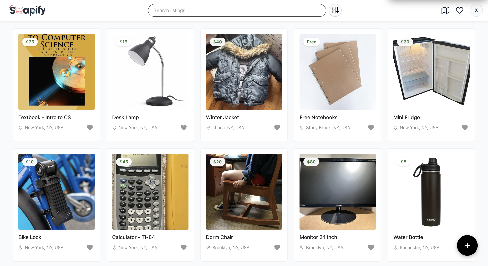
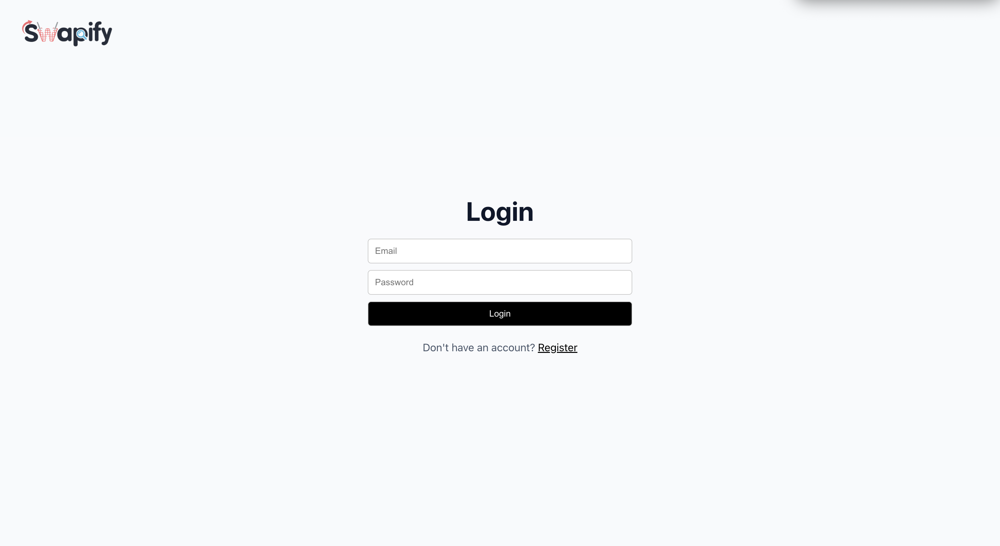
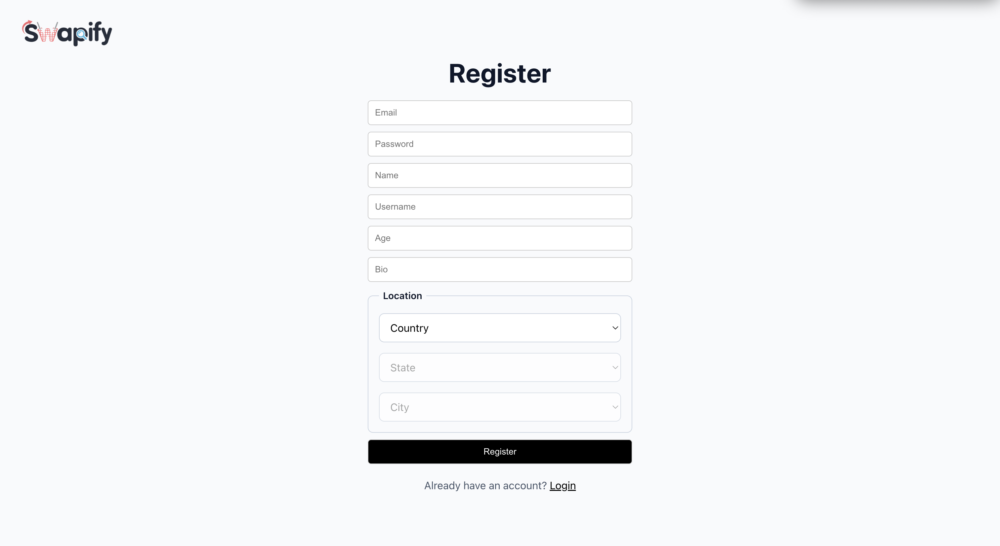
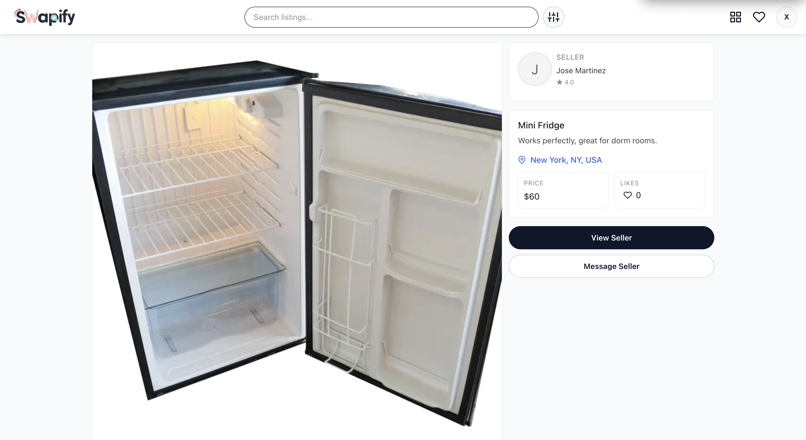
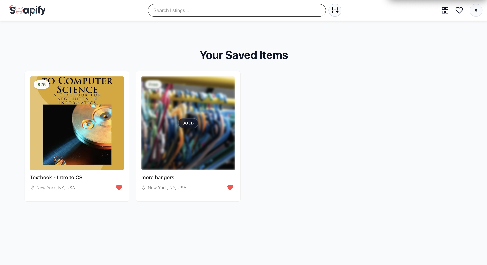
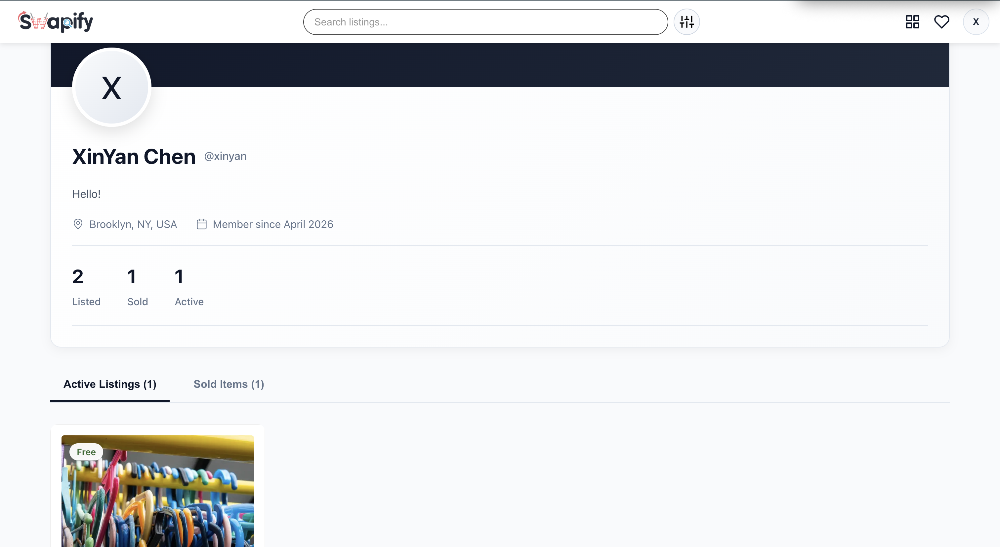

<p align="center">
	
</p>

---

## Demo

### Previews

<table>
	<tr>
		<td align="center"><strong>Home (Map Page)</strong><br /></td>
		<td align="center"><strong>Grid View</strong><br /></td>
	</tr>
	<tr>
		<td align="center"><strong>Login</strong><br /></td>
		<td align="center"><strong>Register</strong><br /></td>
	</tr>
	<tr>
		<td align="center"><strong>Listing Details</strong><br /></td>
		<td align="center"><strong>Saved Listings</strong><br /></td>
	</tr>
	<tr>
		<td align="center"><strong>Profile</strong><br /></td>
		<td></td>
	</tr>
</table>

---

## Inspiration, Goals, and Target Audience

Swapify is a student marketplace inspired by the NYU Swap Store. It was built for students to buy, sell, or get items from other students nearby or within the same school. The app focuses on making student-to-student transactions simple and easy to navigate. The main goals were to:

- make it easy to browse and post student listings
- support location-aware discovery through map-based browsing and search
- create a simple flow for login, registration, saving items, and viewing profiles

---

## Initial User Requirements

For the original feature goals and product requirements, see the initial [User Requirements](UserRequirements.md).

---

## App Stack

- **Frontend**: React 19, Vite, React Router, CSS modules/files
- **Map**: Leaflet + React Leaflet
- **UI Icons**: React Icons
- **Data Layer**: API helper modules in `swapify/src/api`
- **State/Auth**: React hooks + local storage session state
- **Testing**: Vitest + Testing Library (JSDOM)
- **Linting**: ESLint
- **Backend**: AXiS (Python) + MongoDB

---

## Frontend Pages and Main Components

#### Home (Map Page)

```text
Home (Map Page)
|_ Navbar
|_ MapVisualizer
|_ MapListingCard
|_ CreateListing
```

- Main visual browsing page with location-based discovery.
- Uses `Navbar`, `MapVisualizer`, `MapListingCard`, and `CreateListing`.
- Lets users explore listings by location and create listings when logged in.

#### Grid Page

```text
Grid Page
|_ Navbar
|_ Post
|_ CreateListing
```

- Shows listings in a card grid layout.
- Uses `Navbar`, `Post`, and `CreateListing`.
- Supports search and filtering across the listing feed.

#### Login Page

```text
Login Page
|_ Link (router)
```

- Handles sign-in with email and password.
- Redirects users to home page after successful login.

#### Register Page

```text
Register Page
|_ Link (router)
|_ LocationDropdown
```

- Handles account creation and basic profile setup.
- Uses `LocationDropdown` to capture location.
- Stores auth state after successful registration for immediate app access.
- Redirects users to home page after successful regristration.

#### Individual Post Page

```text
Individual Post Page
|_ Navbar
|_ ProfileAvatar
```

- Shows one listing in detail.
- Uses `Navbar` and `ProfileAvatar`.
- Supports actions such as save/like and viewing seller details/options to "Mark as Sold" for sellers.

#### Saved Items Page

```text
Saved Items Page
|_ Navbar
|_ Post
```

- Shows listings the current user has saved.
- Uses `Navbar` and `Post`.
- Supports quick search through saved posts.

#### Profile Page

```text
Profile Page
|_ Navbar
|_ ProfileAvatar
|_ Post
```

- Shows user profile details and user-owned listings.
- Uses `Navbar`, `ProfileAvatar`, and `Post`.
- Separates active vs sold listings.

#### App-level Shared Components

```text
App-level Shared
|_ NotificationBar (rendered in app shell)
|_ Navbar (used across most pages)
|_ CreateListing (used in Home and Grid)
|_ Post (used in Grid, Saved Items, Profile)
```

---

## Backend

The backend lives in the separate AXiS repository. For setup, data model details, and API behavior, refer to the backend README here: https://github.com/XinYanC/AXiS

The AXiS API is deployed on PythonAnywhere at `https://xinyanc.pythonanywhere.com/`. The frontend communicates with the backend through API helper modules in `swapify/src/api/`:

- `swapify/src/api/listings.js` — read, search, create, and update listings
- `swapify/src/api/users.js` — read user data, create users, update user profiles
- `swapify/src/api/auth.js` — handle login and authentication
- `swapify/src/api/cities.js` — fetch city/location data
- `swapify/src/api/countries.js` — fetch country data
- `swapify/src/api/states.js` — fetch state data
- `swapify/src/api/system.js` — system-level endpoints

---

## Best Accomplishments

- Identified the appropriate data models and determined how to integrate them into the frontend through iterative testing and refinement
- Implemented the map visualizer as a stretch goal, successfully incorporating it into the browsing experience
- Engaged in productive team discussions to clearly define desired functionality and scope
- Effectively prioritized tasks and tracked progress using a Kanban board

---

## Stretch Goals

Here are some stretch goals that were met:

- [x] Map or globe-based visualization
- [x] Items searchable by ZIP code or geographic coordinates

---

## Blockers and Issues

- Encountered race conditions during frontend refreshes, particularly on the profile page, post page, and saved items flow
- Frequent database resets and data re-uploads to MongoDB due to ongoing model changes
- Had to manually create listings from scratch due to the absence of an initial dataset
- Faced limitations from incomplete or missing geodata in certain countries

---

## Future Plans

- [ ] Distance-radius filtering (search/filter items within 1 mile, 5 miles, etc.)
- [ ] School affiliation and dorm-based filtering
- [ ] Proximity-based recommendations (show items "near you")
- [ ] Transaction notifications (seller/buyer updates, pickup confirmations)
